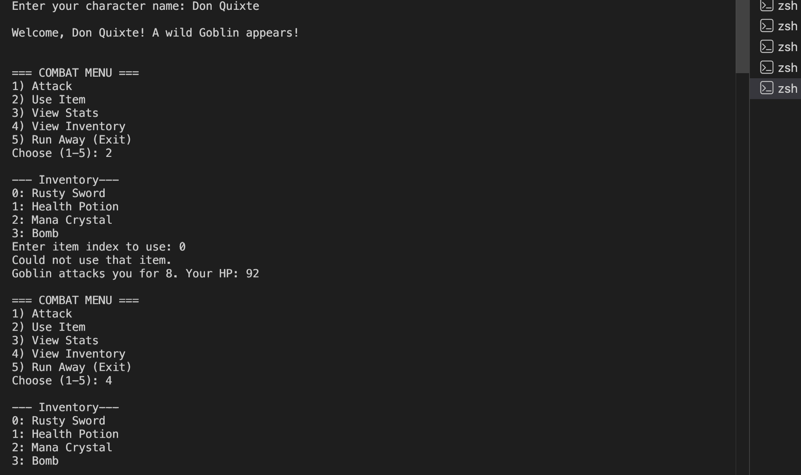

# ⚔️ Creature Sim — Console RPG

A turn-based combat RPG playable in the terminal. Fight your way through a Goblin, Troll and Dragon using attacks, spells and items — and see how high you can score.

Built in C# as part of my software engineering bootcamp to practise object-oriented programming concepts including inheritance, polymorphism, encapsulation and method overloading.

---

## 📸 Preview



---

## 🎮 How to Play

### Prerequisites
- [.NET SDK](https://dotnet.microsoft.com/download) installed

### Run the game
```bash
git clone https://github.com/KJWsyntax/console-game.git
cd console-game
dotnet run
```

### Controls
| Input | Action |
|-------|--------|
| `1`   | Attack the enemy |
| `2`   | Use a special ability (costs mana) |
| `3`   | Use an item from your inventory |
| `4`   | View your stats and score |
| `5`   | View inventory |
| `6`   | Run away (exit) |

---

## ✨ Features

- ⚔️ Turn-based combat against 3 escalating enemies
- 🐉 Unique enemy behaviours — the Troll enrages at low health, the Dragon deals double fire damage
- ✨ Special abilities — Power Strike (2.5x damage) and Fireball (40 magic damage), both mana-gated
- 🎒 Inventory system — Health Potions, Mana Crystals and a Bomb
- 📊 Scoring system — earn points per enemy defeated (Goblin: 100, Troll: 250, Dragon: 500)
- ❤️ Visual HP and mana bars using block characters
- 🏥 Recovery bonus between fights
- 💥 Full exception handling for invalid inputs

---

## 🧱 OOP Concepts Demonstrated

| Concept | Where |
|---------|-------|
| **Abstraction** | `Creature` abstract base class with abstract `Attack()` method |
| **Inheritance** | `Goblin`, `Troll`, `Dragon` all extend `Creature` |
| **Polymorphism** | Each creature overrides `Attack()` with unique behaviour |
| **Encapsulation** | Private fields exposed via public properties and controlled methods |
| **Method Overloading** | `UseItem(int index)` and `UseItem(string name)` |

---

## 👾 Enemies

| Enemy | HP | Attack | Special | Score |
|-------|----|--------|---------|-------|
| Goblin | 35 | 8 | — | 100 pts |
| Troll  | 60 | 10 | Enrages at ≤30 HP (+5 dmg) | 250 pts |
| Dragon | 120 | 15 | Always deals 2x fire damage | 500 pts |

---

## 🎒 Items

| Item | Effect |
|------|--------|
| Health Potion | Restores 25 HP |
| Mana Crystal | Restores 15 Mana |
| Bomb | Deals 30 damage to the enemy |
| Rusty Sword | Starting weapon (flavour item) |

---

## 💡 What I Learned

- Structuring a program using **abstract classes and inheritance** in C#
- How **polymorphism** lets different objects share an interface but behave differently
- Managing **state across a game loop** with a `while` loop and `switch` statement
- Using **method overloading** to handle the same action in multiple ways
- Writing **defensive code** — input validation, bounds checking, and `TryParse` over bare `try/catch`
- Keeping data **encapsulated** with `private` fields and read-only public access

---

## 🔮 Future Improvements

- [ ] Multiple character classes (Warrior, Mage, Rogue)
- [ ] Random enemy encounters
- [ ] Save/load game state
- [ ] Browser-playable version rebuilt in JavaScript
- [ ] High score leaderboard

---

## 👩🏾‍💻 Author

**Kemi Joan Willoughby**  
Business portfolio manager turned software engineer  
[GitHub](https://github.com/KJWsyntax) · [Portfolio](https://KJWsyntax.github.io)

---

## 📄 Licence

This project is open source and available under the [MIT Licence](https://opensource.org/licenses/MIT).