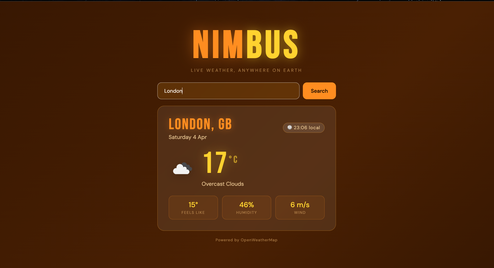

# ☁️ Nimbus — Weather App

A dynamic, real-time weather application that displays live conditions for any city in the world. Built as part of my software engineering journey after transitioning from a business portfolio management background.

---

## 🌤️ Live Demo

> Coming soon 

---

## 📸 Preview



---

## ✨ Features

- 🔍 Search any city worldwide by name
- 🌡️ Live temperature, feels like, humidity and wind speed
- 🕐 Local time display for the searched city
- 🎨 Dynamic background that changes to match the weather condition:
  - ☀️ Sunny — warm orange and gold gradient
  - ☁️ Cloudy — deep moody tones
  - 🌧️ Rainy — cool dark blues with animated rain overlay
  - ❄️ Snow — soft light palette with falling snow effect
  - ⛈️ Storm — dark dramatic reds
  - 🌫️ Mist/Fog — warm hazy browns
- ⌨️ Press Enter or click Search to fetch weather
- 📱 Fully responsive — works on mobile and desktop

---

## 🛠️ Built With

- **HTML5**
- **CSS3** — animations, glassmorphism, dynamic theming
- **Vanilla JavaScript** — async/await, Fetch API, DOM manipulation
- **[OpenWeatherMap API](https://openweathermap.org/api)** — live weather data

---

## 🚀 Getting Started

### 1. Clone the repo
```bash
git clone https://github.com/KJWsyntax/nimbus-weather-app.git
cd nimbus-weather-app
```

### 2. Get a free API key
- Sign up at [openweathermap.org](https://openweathermap.org/api)
- Navigate to **API Keys** in your account dashboard
- Copy your key

### 3. Add your API key
Open `index.html` and find this line near the bottom:
```javascript
const API_KEY = 'YOUR_API_KEY_HERE';
```
Replace `YOUR_API_KEY_HERE` with your actual key.

### 4. Open in browser
No build tools or installs needed — just open `index.html` in your browser and you're good to go!

---

## 📁 Project Structure

```
nimbus-weather-app/
│
├── index.html      # All HTML, CSS and JavaScript in one file
└── README.md       # You're reading it!
```

---

## 💡 What I Learned

- How to consume a **REST API** using the Fetch API and async/await
- Handling **API errors** gracefully with try/catch
- Working with **timezones** — converting UTC to local city time using timezone offset data
- Dynamic **CSS class switching** to change the entire page theme based on API response data
- Creating **CSS animations** including rain overlay and snow effects
- Building a clean, responsive UI without any frameworks

---

## 🔮 Future Improvements

- [ ] 5-day weather forecast strip
- [ ] Use my location button (Geolocation API)
- [ ] Toggle between °C and °F
- [ ] Favourite cities / search history
- [ ] Day and night mode based on local time

---

## 👩🏾‍💻 Author

**Kemi Joan Willoughby**  
Business portfolio manager turned software engineer  
[GitHub](https://github.com/KJWsyntax) · [Portfolio](https://KJWsyntax.github.io)

---

## 📄 Licence

This project is open source and available under the [MIT Licence](https://opensource.org/licenses/MIT).